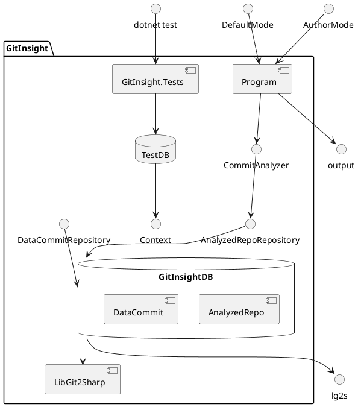

# The architecture of GitInsight

```plantuml
@startuml
() "DefaultMode" as commit
() "AuthorMode" as author
() "dotnet test" as dotnettest

package "GitInsight" {
  [Program] as program
  [LibGit2Sharp] as lb2s

  [GitInsight.Tests] as test

  () "CommitAnalyzer" as commitanalyzer
  () "Context" as context

  () "AnalyzedRepoRepository" as analyzedrepo
  () "DataCommitRepository" as datarepo
  
  database "TestDB" as testdb {

  }

  database "GitInsightDB" as db {
    [AnalyzedRepo]
    [DataCommit]
  }
}

test --> testdb
testdb --> context

program --> commitanalyzer
commitanalyzer --> analyzedrepo

analyzedrepo --> db
db --> lg2s
datarepo --> db

dotnettest --> test
commit --> program
author --> program

db --> lb2s

program --> () output
@enduml
```

